# 🧠 RAG with Memory — Agentic Web Memory Backend

A fully-agentic **AI memory system** built with `FastAPI`, `Gemini`, and `FAISS`.
It continuously **learns from the web pages you visit**, builds a **semantic memory** of them, and later **recalls the precise snippet and source** when we ask — functioning as our **personal, retrieval-augmented web memory agent**.

---

## 🚀 Concept

This project turns the classic RAG (Retrieval-Augmented Generation) pipeline into a **living memory system** — one that perceives, decides, acts, and remembers.

> “It doesn’t just search — it *remembers* what we read, when we read it, and where we saw it.”

We can think of it as a self-contained *AI hippocampus* for the browser.

---

## 🧩 Agentic Architecture

The backend follows the cognitive architecture:

> **Agent → Perception → Memory → Decision → Action**

Each layer mirrors a mental function, powered by **Gemini models** and **vector memory**.

```mermaid
%% 4. Agentic Architecture Stack
flowchart TD
    A("🧠 Chrome Extension") --> B("HTTP API <br> (FastAPI)");
    B --> C("Core Logic <br> (core.py)");
    C --> D("MCP Tools <br> (mcp_tools.py)");
    D --> E("Agentic Loop <br> (LLM Reasoning)");
    E --> F("🗄️ FAISS Vector Store <br> (Long-Term Memory)");

    %% Styling
    style A fill:#4285F4,color:#fff
    style B fill:#fbbc05,color:#333
    style D fill:#7c4dff,color:#fff
    style E fill:#EA4335,color:#fff
    style F fill:#34a853,color:#fff
```




| Layer          | Role                                                                                      |             |           |
| -------------- | ----------------------------------------------------------------------------------------- | ----------- | --------- |
| **Perception** | Gemini interprets text/query, classifies intent, and hints which tool to use.             |             |           |
| **Decision**   | Gemini planner outputs structured calls like `FUNCTION_CALL: search_documents             | query="..." | top_k=5`. |
| **Action**     | Executes the function, then writes the result back into short-term memory.                |             |           |
| **Memory**     | Maintains both *working memory* (session context) and *long-term FAISS memory*.           |             |           |
| **MCP Tools**  | Provide clean modular interfaces (`index_page`, `search_documents`, `process_documents`). |             |           |

---

## 🔬 Key Idea

Each webpage is broken into **semantic chunks**, embedded via **Google’s `text-embedding-004`** (or optionally local Nomic embeddings), and stored in a FAISS vector store.
When a user later asks a question, the system performs **semantic + temporal retrieval**, boosting newer content and returning the *exact snippet* and *URL* where it appeared.

---

## 💡 Example Scenario

1. We read multiple pages on *vector databases*.
2. Weeks later if we ask:

   > “Which article explained IVF and HNSW in FAISS?”
3. The agent searches its memory and returns:

   ```
   “IVF and HNSW indexing accelerate large-scale similarity search...”
   [Source: https://example.com/vector-db, ID: a3c1_002]
   ```

   → The extension opens the page and highlights that text.

---

## 🧠 Core Features

| Feature                       | Description                                                                          |
| ----------------------------- | ------------------------------------------------------------------------------------ |
| **Gemini-Driven Reasoning**   | Both perception and decision use Gemini 2.0 Flash for intelligent planning.          |
| **Dual Embedding Backend**    | Supports *Google embeddings* for precision or *Ollama/Nomic* for offline use.        |
| **Temporal Awareness**        | Adds time-decay weighting: recent knowledge ranks higher in retrieval.               |
| **Deduplication**             | SHA-1 hashing avoids re-embedding duplicate content.                                 |
| **Hybrid Memory**             | Short-term (RAM) + long-term (FAISS) = contextual continuity.                        |
| **MCP + REST Dual Interface** | Accessible both as an MCP stdio toolset and as a FastAPI HTTP service.               |
| **Document Ingestion**        | Converts `.html`, `.pdf`, `.docx`, `.md` via MarkItDown for batch indexing.          |
| **Extension-Ready**           | `/index_page` and `/search` endpoints integrate directly with Chrome MV3 extensions. |

---

## ⚙️ Tech Stack

| Layer          | Technology                                              | Purpose                                     |
| -------------- | ------------------------------------------------------- | ------------------------------------------- |
| **LLM**        | Gemini 2.0 Flash                                        | Perception & decision reasoning             |
| **Embeddings** | Google `text-embedding-004` / Ollama `nomic-embed-text` | Vector representations                      |
| **Vector DB**  | FAISS                                                   | Nearest-neighbor retrieval                  |
| **Protocol**   | MCP (Model Context Protocol)                            | Modular tool calls                          |
| **API**        | FastAPI                                                 | Bridge for Chrome extension                 |
| **Parsing**    | MarkItDown                                              | Clean text extraction from HTML/PDF         |
| **Package**    | uv                                                      | Dependency management & virtual environment |

---

## 🧮 Data & Memory Model

| Type                   | Description                                                       |
| ---------------------- | ----------------------------------------------------------------- |
| **Short-Term Memory**  | Session-scoped objects managed in RAM (`memory.py`).              |
| **Long-Term Memory**   | FAISS index + JSONL metadata with embeddings, titles, timestamps. |
| **Temporal Weighting** | `score = sim * (1 + α * freshness(days))` — prioritizes recency.  |
| **Metadata Schema**    | `{url, title, snippet, chunk_id, timestamp, score}`               |
| **Chunking**           | ~900 characters with 160-char overlap for semantic continuity.    |

---

## 📦 Repository Structure

```
rag_memory_agent/
├── core.py           # Core FAISS, embedding, chunking, and indexing logic
├── mcp_tools.py      # MCP-decorated tools (index_page, search_documents)
├── http.py           # REST endpoints for Chrome extension
├── agent.py          # Orchestrator for Gemini reasoning loop
├── perception.py     # Gemini perception (intent extraction)
├── decision.py       # Gemini decision (planner)
├── action.py         # Executes tool calls
├── memory.py         # Short-term session memory
├── models.py         # Pydantic schemas
├── config.py         # Centralized configuration (.env loader)
├── documents/        # Optional batch ingestion folder
└── faiss_index/      # Persistent FAISS store + metadata.jsonl
```


---

## 🧭 Data Flow

### 🔹 Indexing

This diagram shows the "learning" flow, where a webpage is processed, embedded, and stored in the long-term FAISS memory.

```mermaid
%% 1. Indexing Flow (Learning)
flowchart TD
    A[User visits a webpage] --> B(🧠 Chrome Extension);
    B --> C{POST /index_page};
    C --> D[FastAPI Backend];
    D --> E(core.index_page_core);
    E --> F(1. Chunk Text);
    F --> G("2. Create Embeddings <br> [Google or Ollama]");
    G --> H("3. Store in FAISS <br> + metadata.jsonl");
    H --> I[(🗄️ Long-Term Memory <br> FAISS Vector Store)];

    %% Styling
    style B fill:#4285F4,color:#fff
    style C fill:#fbbc05,color:#333
    style I fill:#34a853,color:#fff
```



### 🔹 Searching

This diagram shows the full "recall" loop, where the agent perceives the user's query, plans a search, retrieves results, and ranks them using the hybrid-temporal model.

```mermaid
%% 2. Agentic Search Flow (Recalling)
flowchart TD
    A["User Query <br> (CLI or Extension)"] --> B("1. Perception <br> [Gemini classifies intent]");
    B --> C("2. Add Query to STM <br> [memory.py]");
    C --> D("3. Decision <br> [Gemini plans tool call]");
    D --> E("4. Action <br> [execute(plan)]");
    E --> F("5. Core Retrieval <br> [core.search_documents_core]");
    F -- "Queries" --> G[(🗄️ Long-Term Memory <br> FAISS Vector Store)];
    G -- "Returns Top-K Hits" --> F;
    F --> H("6. Hybrid Temporal Ranking <br> [Freshness + Popularity]");
    H --> I(7. Add Result to STM);
    I --> J[✅ Formatted Answer];

    %% Styling
    style B fill:#EA4335,color:#fff
    style D fill:#EA4335,color:#fff
    style H fill:#fbbc05,color:#333
    style G fill:#34a853,color:#fff
    style J fill:#4285F4,color:#fff
```



---

## 🏗️ Running the Backend

### 1️⃣ Environment & Install

```bash
uv venv
uv sync
```


### 2️⃣ Choose Embedding Provider

You can run the system with **either** local Ollama or cloud-based Google embeddings.

#### 🧩 Option A — Local (Ollama)

1. **Download Ollama**
   → [https://ollama.com/download](https://ollama.com/download)

2. **Pull and run the model**

   ```bash
   ollama pull nomic-embed-text
   ollama serve
   ```

3. **Set provider in `.env`**

   ```bash
   EMBEDDINGS_PROVIDER=ollama
   EMBED_URL=http://localhost:11434/api/embeddings
   EMBED_MODEL=nomic-embed-text
   ```

#### ☁️ Option B — Google Embeddings

1. **Set provider and credentials in `.env`:**

   ```bash
   # "google" or "ollama"
   EMBEDDINGS_PROVIDER=google
   GOOGLE_API_KEY="<insert_your_api_key>"
   GOOGLE_EMBED_MODEL=text-embedding-004
   ```

2. Ensure dependencies are installed:

   ```bash
   uv add llama-index-embeddings-google-genai google-genai
   ```

---

### 3️⃣ Start the API

```bash
uvicorn rag_memory_agent.http:app --reload --port 8000
```

---

### 4️⃣ Index & Search

```bash
curl -X POST http://localhost:8000/index_page \
  -H "content-type: application/json" \
  -d '{"url":"https://example.com","title":"Example","text":"Vector DBs use IVF and HNSW..."}'

curl "http://localhost:8000/search?q=vector%20dbs"
```

---
### 5️⃣ CLI Agent

```bash
python -m rag_memory_agent.agent
> what was that blog about HNSW indexing?
```

---

## 🧩 Chrome Extension — Smart Memory + Highlighting

The included Chrome MV3 extension not only indexes pages we visit — it also **highlights the exact text** when we click a search result.

### ✨ Key Features

* **Auto-Indexing:** Passively indexes the text of every page we visit (skipping confidential domains like Gmail or Slack).
* **Configurable Denylist:** We can edit which sites to skip via the extension’s **Setting** page.
* **Instant Recall:** Open the popup, type a query, and get back precise snippets with their URLs.
* **Smart Highlighting:**
  When we click a result, the extension:

  1. Opens the original webpage.
  2. Automatically scrolls and **highlights the exact text snippet** that matched query — using Chrome’s native `#:~:text=` link fragments plus a JavaScript fallback for all browsers.

This makes recall **contextual and visual** — we’re taken right back to the exact paragraph where we learned something.

---


## 🧩 Loading the Chrome Extension

The repository includes a working Chrome MV3 extension inside the **`extension/`** folder.  
It provides a minimal UI to search your indexed pages and highlights the retrieved snippet directly on the original website.

### 🔹 Steps

1. **Open Chrome → `chrome://extensions`**
2. **Enable Developer mode** (top-right toggle)
3. **Click “Load unpacked”** and select the project’s `extension/` folder.
4. Pin 🧠 **Web Memory** from the extensions bar.

### 🔹 Usage

- The extension automatically indexes pages you visit (except confidential ones like Gmail, Slack, WhatsApp, etc.).  
- Click the extension icon to **search your web memory**.  
- Select a result → the page opens and **highlights** the matching text.  
- You can configure the backend URL and denylist in the extension’s **Options page**.

> Make sure the backend FastAPI server is running at `http://localhost:8000` (or the URL you set in Options).


## 🧩 MCP Tools

| Tool                  | Description                                     |
| --------------------- | ----------------------------------------------- |
| **index_page**        | Ingests live web text (chunks → embed → FAISS). |
| **search_documents**  | Returns semantic matches with source metadata.  |
| **process_documents** | Batch-ingests `/documents` folder.              |

---

## 🏆 Unique Aspects

✅ **Unified Core Architecture** : All indexing, retrieval, and embedding logic consolidated in `core.py`, ensuring MCP, REST, and agent all share one codebase.

✅ **Temporal & Semantic Hybrid Ranking**: Combines cosine similarity with a lightweight temporal decay model — newer memories surface first.

```python
  score = sim * (1 + α * freshness(days))
  # newer pages rank higher.
  ```

✅ **Dual-Mode Memory**: Supports **short-term** (RAM) and **long-term** (FAISS) memory separation — enabling hybrid reasoning loops.

✅ **Dual Transport (MCP + REST)**: Works both as a traditional MCP stdio toolset *and* a REST API — bridging AI agent ecosystems and browser extensions.

✅ **Dynamic Embedding Backend**: Can seamlessly switch between local (`ollama nomic-embed-text`) and cloud (`text-embedding-004`) without touching code.

✅ **Agentic Reasoning with Gemini**: Perception and decision stages leverage Gemini 2.0 Flash for contextual tool planning, not static prompts.

✅ **Data Efficiency**: Uses deduplicated SHA1 chunk hashing and JSONL metadata for minimal storage overhead.

✅ **Practical RAG Evolution**: Instead of ephemeral chat memory, this agent builds a persistent semantic map of what the user reads online.

---

## 🌐 Online / Offline Mode

The backend dynamically adapts between **Gemini-powered reasoning** and a **fully local fallback** depending on environment configuration.

* When `GEMINI_API_KEY` (or `GOOGLE_API_KEY`) is **available** in `.env`, both **Perception** and **Decision** modules use **Gemini 2.0 Flash** for natural-language understanding and planning.
* When no key is present, they **gracefully fall back** to lightweight, rule-based logic — still able to perform indexing and semantic retrieval locally.
* All vector embeddings, FAISS indexing, and search remain identical in either mode.

```text
Online  → Gemini reasoning + Google or Ollama embeddings
Offline → Rule-based reasoning + Ollama embeddings (no internet required)
```

This ensures the system works seamlessly **offline with Ollama** or **online with Gemini/Google**, without any code changes — only `.env` variables determine the mode.

---

## 🕒 Temporal & Semantic Hybrid Ranking

Retrieval now blends **semantic similarity** with a **bounded temporal-popularity signal** instead of multiplying them.
Each FAISS hit is scored as a *weighted sum* where semantics dominate and freshness / frequency provide a gentle nudge.

### Concept

```python
# Weighted-blend scoring (Option A)
score = (SIM_WEIGHT * sim) + (TEMP_WEIGHT * hybrid)

# where:
#   hybrid = w_f * freshness + w_p * popularity
#   freshness = exp(-λ * days)      # exponential half-life (≈7 days)
#   popularity = 1 - exp(-visits/3) # saturating with repeated visits
```



```mermaid
%% 3. Hybrid Ranking Formula
graph TD
    subgraph "Input Data"
        Q[Query Vector]
        C[Chunk Vector]
        TS[Timestamp]
        V[Visit Count]
    end

    subgraph "Scoring Pipeline"
        Q & C --> S("Semantic Similarity <br> [sim]");
        TS --> F("Freshness Score <br> [exp(-λ * days)]");
        V --> P("Popularity Score <br> [1 - exp(-visits/3)]");
        F & P --> H("Hybrid Temporal Score <br> [w_f * freshness + w_p * pop]");
        S & H --> FS("<b>Final Score</b> <br> [SIM_WEIGHT * sim + TEMP_WEIGHT * hybrid]");
    end

    %% Styling
    style S fill:#4285F4,color:#fff
    style H fill:#fbbc05,color:#333
    style FS fill:#34a853,color:#fff
```

**How it works**

| Component        | Meaning                                                                                                            |
| ---------------- | ------------------------------------------------------------------------------------------------------------------ |
| **sim**          | Pure cosine similarity between the query and stored chunk.                                                         |
| **freshness**    | Exponentially decays with age so recent pages retain higher influence.                                             |
| **popularity**   | Increases smoothly with visit count; a few revisits help, excessive visits saturate.                               |
| **hybrid**       | Linear blend of freshness (`w_f`) and popularity (`w_p`).                                                          |
| **Weighted sum** | Final `score` is mostly semantic (`SIM_WEIGHT ≈ 0.9`) with a small temporal-popularity term (`TEMP_WEIGHT ≈ 0.1`). |

This keeps **semantic relevance as the main driver** while allowing *recent or repeatedly visited pages* to break ties among equally similar results.

### Default parameters

| Parameter                                | Default   | Effect                            |
| ---------------------------------------- | --------- | --------------------------------- |
| `HALF_LIFE_DAYS`                         | 7         | Freshness halves every 7 days     |
| `SIM_WEIGHT` / `TEMP_WEIGHT`             | 0.9 / 0.1 | Semantics ≈ 90 %, Temporal ≈ 10 % |
| `FRESHNESS_WEIGHT` / `POPULARITY_WEIGHT` | 0.7 / 0.3 | Blend between recency & visits    |
| `RECENCY_ALPHA`                          | —         | (Deprecated in blend mode)        |

### Intuition

> *Semantic similarity decides what’s relevant;
> temporal-popularity decides which relevant results feel freshest.*

In practice, this means that if two pages explain the same concept equally well, the one we **read recently** or **visit more often** will appear first — while irrelevant pages never outrank semantically strong ones.

---

## Summary

This project demonstrates how **RAG can evolve into long-term memory**:
an AI system that learns continuously, remembers semantically, and retrieves with context awareness — bridging *information retrieval*, *memory persistence*, and *agentic cognition*.
